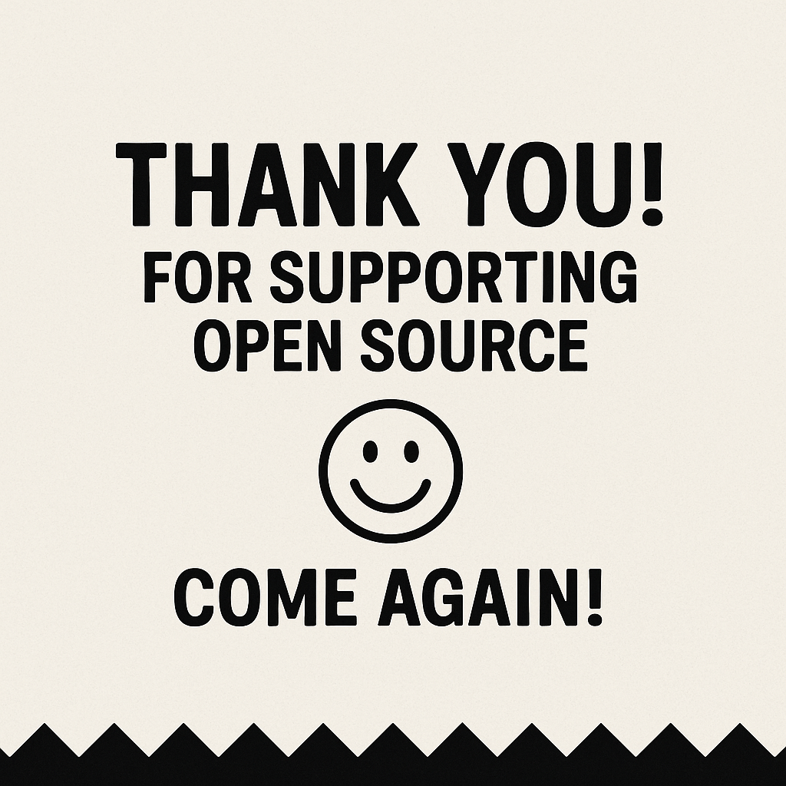

# 🧾 CodePizza License Receipt (MIT Edition)

**Order #:** 001  
**Table:** Open Source  
**Server:** MIT  
**Date:** 2025  
**Customer:** C7N, Inc. 

---

**🍕 ITEMS ORDERED**

- ✅ Unlimited use of the Software  
- ✅ Rights to copy, modify, merge, publish, distribute, sublicense, and sell  
- ✅ Permission to remix and reuse the code, even commercially  
- ✅ Free refills on creativity  

**🧀 Special Instructions:**  
- Must include this license and the original credits with any slice you serve.  
- Don’t pretend you made the whole pizza if you didn’t.

---

**💸 TOTAL COST: $0.00**  
(But if you want to tip the devs with good vibes or PRs, we won’t stop you.)

---

**🛑 DISCLAIMERS & FINE PRINT**  
The Software is served "AS IS", with no guarantees, warranties, or bug-free crusts.  
We are not responsible for lost time, broken builds, production fires, or melted keyboards.

---

**🍕 TL;DR:**
Use it. Remix it. Ship it. Sell it. Just don’t sue us, and leave the credits on the box.

---

**Thank you for supporting open source. Come again!**

— ***The CodePizza Crew***

