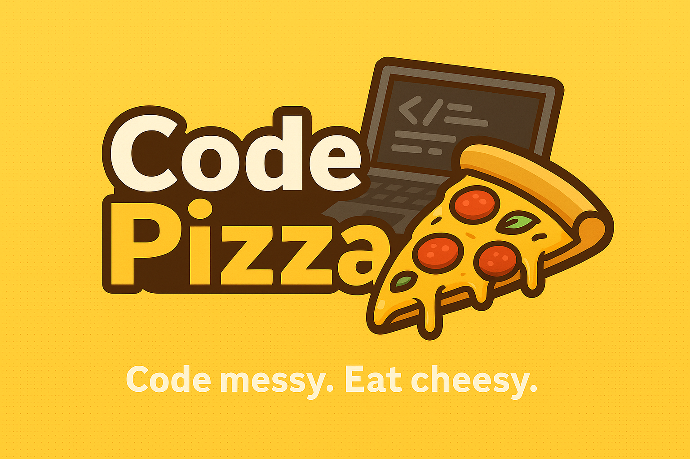

# 🍕 Code Pizza

> ***“Code messy. Eat cheesy.”***
> 
  
  





---

## 🧠 What is Code Pizza?

**Code Pizza** is a quirky, developer-friendly brand celebrating the casual, chaotic joy of coding and comfort food.

It’s a:
- 🎉 Creative outlet  
- 🌐 Community & content hub  
- 💡 Open-source playground for devs who write bugs by day and eat pizza by night

You bring the code, we bring the cheese.

---

## 🍕 What You’ll Find Here

We're still putting toppings on this pie, but here's what you might see soon:

- 🛠️ Open-source tools you didn’t know you needed  
- 🍜 Spaghetti code refactor challenges  
- 🎨 Pizza-themed web templates  
- 📹 Tutorial videos with extra cheese  
- 🧠 Developer content with humor baked in  
- 😬 Bugs. Lots of them.

Whether you're here to learn, build, laugh, or cry over broken builds, you're welcome.

---

## 📦 Coming Soon

```bash
npm install code-pizza

# Just kidding... unless?
```
Stay tuned for our first few releases—including:

🔧 Browser extensions

🧩 Mini games

🍕 CLI tools

🎭 Open calls for contributors

---

## 🍴 Contributing
Pull requests welcome. Creativity required. Dignity optional.

Before contributing:

Read CONTRIBUTING.md 🍕

Glance at our Code of Conduct, aka "Don't Be a Jerk"

We value good ideas, wild experiments, and devs who bring the sauce.

---

## 📣 Follow the Sauce Trail
More toppings are on the way!

🌍 Website: codepizza.dev (coming soon)

🎥 YouTube: Code Pizza

💬 Discord: Invite Coming Soon

🧵 Twitter/X: @codepizzadev

---

## 📄 License
MIT.
Because freedom tastes better with mozzarella.

---

## 🤌 Code Pizza Philosophy
At Code Pizza, we believe:

🍕 Bugs are toppings

💻 Forks are optional

🧠 Stack traces are seasoning

🚀 Every project is a little undercooked by design

Pull up a chair. Take a slice. Write some gloriously flawed code.

**Welcome to the Pizza Party.**


